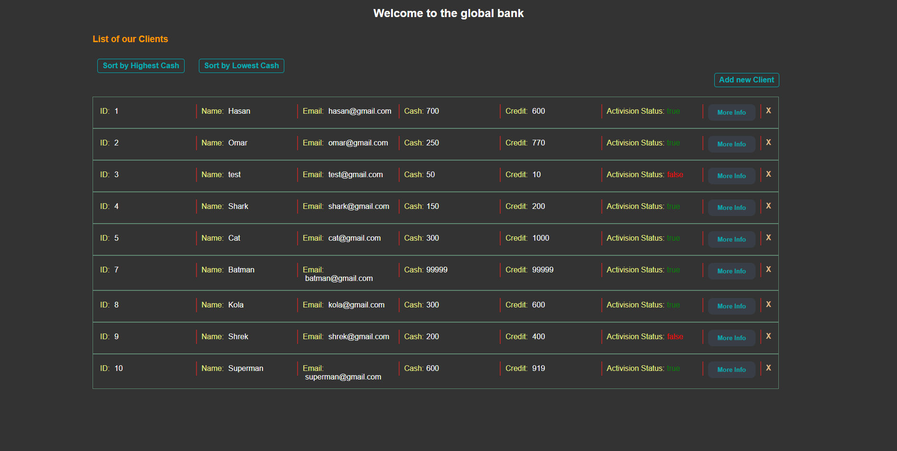
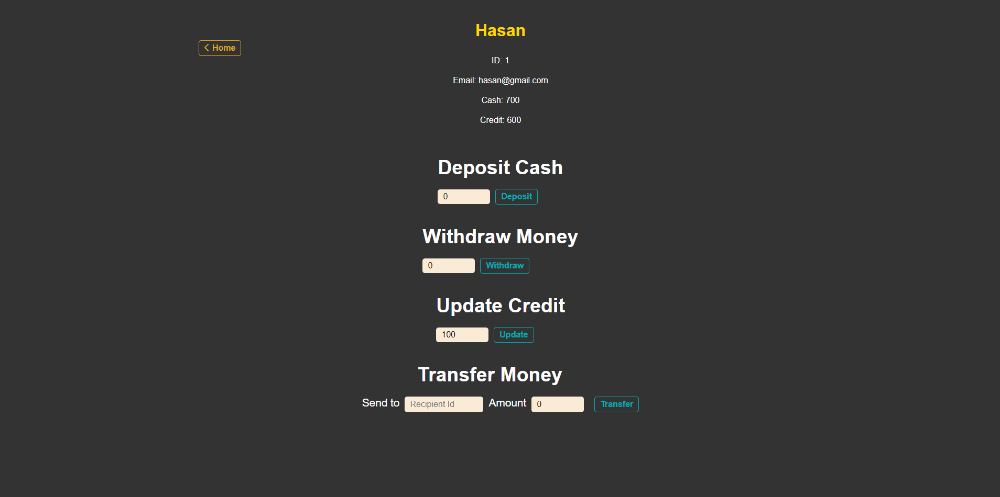
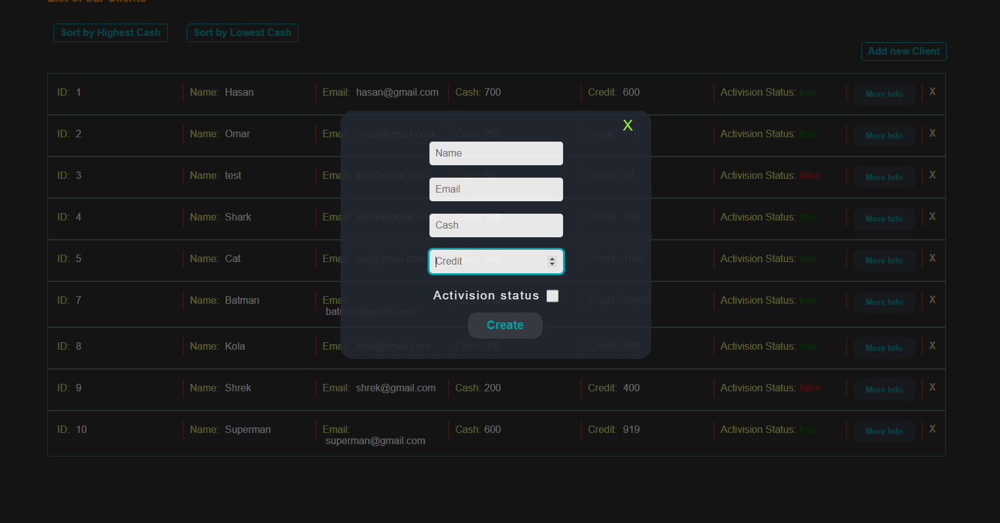

# Bank

# Fullstack Bank Website

I have created a Bank website using backend [MongoDB / Mongoose ] and frontend [React].
I have used Material UI for the sign-up and sign-in pages.

## Links

- Backend : https://bank-api-backend-using-mongoose.onrender.com/
- Frontend : https://bank-mongoose-frontend.netlify.app/

## About

- You can create new account.
- You can log-in to your account.
- I used bcrypt to hash the password.
- I saved each user token and info in the Local-Storage.

- I have used axios package to connect my backend with my frontend.
- The Home page shows all the clients in the bank with all of their details ,
  ID , Name , Email , Cash , Credit , Activision Status.
  You will also find a more info button next to each user info , when u click on it it will take you
  to the client's page where you will be able to Deposit Cash , Withdraw Money , Update Credit and Transfer Money.

- Next to the more info button you will also find an "X" , this X deletes the client from the database.
- You can add new client to the bank by clicking on the "Add new Client" button.
- You can sort the database by Cash in ascending / descending order.

## Things to know

- Each client has a unique ID , when you create a new client , his ID will be +1 than the current highest ID in the database.
- Each client has a unique email , so you cant create a client with the same email as other client.
- If you don't provide cash or credit , the default value will be 0.
- Active clients can't transfer money to inActive clients.
- InActive clients can't Deposit , Withdraw and transfer money to other clients.
- You can Deposit Cash and Update credit to any value you want.
- If you withdraw money more than the Cash you have in the bank , you will withdraw from your credit.
- If you transfer money more than the Cash you have in the bank , you will transfer from your credit.
- When you transfer money to a client , the other client will receive the money as credit.

## Errors

- Cant deposit negative Cash.
- Cant withdraw negative Cash.
- Cant update credit to negative credit.
- Cant transfer negative money.
- Cant transfer money to yourself.

## Preview





# Bank-API-Backend

I have created a backend server for my frontend Bank website using MongoDB atlas / Mongoose.

I have used Postman for the endpoints with a port of 9999.

I have Clients and I have users [for signing-in/out]

### Clients info:

I have json data with users , each user has :

- ID
- Name
- Cash
- Credit
- isActive

---

### Users info:

- Name
- Email
- Password

## Links:

- Backend Link : https://bank-api-backend-using-mongoose.onrender.com/
- Frontend Link : https://bank-mongoose-frontend.netlify.app/

---

# What can you do in this server for the clients & How?

- You can get all of the Clients info.

```json
( /api/v1/bank )
```

- You can get a specific client info by typing his ID.

```json
(/api/v1/bank/[id of the client])
```

- You can get all of the Clients who has lower/equal amount of cash in the bank.

```json
(api/v1/bank/filter-cash/less-than?cash=[x amount])
```

- You can get all of the Clients who has higher/equal amount of cash in the bank.

```json
(api/v1/bank/filter-cash/more-than?cash=[x amount])
```

- You can sort Clients by cash , for descending order :

```json
(/api/v1/bank/sort-high)
```

- You can sort Clients by cash , for ascending order :

```json
(/api/v1/bank/sort-low)
```

### Protected Routes

- You can create a new client.
- You can delete a client.

- You can deposit cash to a specific client.
- You can update the credit of a specific client.

- A client can withdraw money from his bank account.
- A client can transfer money from his bank account to someone else's bank account.

---

# What can you do in this server for the users & How?

- You can get all of the Users info. (GET)

```json
( /api/v1/users )
```

- You can get a specific user info by his Token. (GET) [Protected]

```json
(/api/v1/users/token [then add the token])
```

- You can create a new user. (POST)

```json
(/api/v1/users/create)
```

- You can delete a user. (DELETE)

```json
(/api/v1/users/[id of user])
```

---

## Things to know:

- When a client withdraws money from his account , first he will withdraw from his cash and if he doesn't have anymore cash
  he will withdraw from his credit.

- When a client transfers money from his bank account to another client , he will transfer using cash and if he doesn't have cash anymore he will transfer his credit , and the other client will always get the money as credit and not as cash.

- You cannot deposit , withdraw and transfer from/to inActive Clients!

- Each user has a unique email.

---

## How to:

I have mentioned above how to GET Clients info , in this section i will be putting the URLs for the other endpoints.
You can try these endpoints in Postman like i did.

- Create a user: /api/v1/bank then put the user info in the body. [name , cash , credit]
- Delete a user: /api/v1/bank/ [user id]
- Deposit cash to a user: /api/v1/bank/deposit-cash/ [user id] ?cash=[amount of cash]
- Update credits of a user: /api/v1/bank/update-credit/ [user id] ?credit=[amount of credit]
- Withdraw money : /api/v1/bank/withdraw/ [user id] ?money=[amount of money]
- Transfer money: /api/v1/bank/transfer/from/ [sender id] /to/ [recipient id] ?money=[amount of money]
